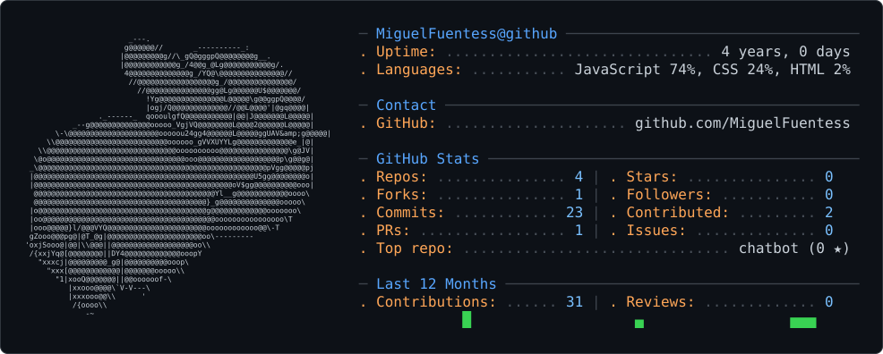

<div align="center">

# Hi, I'm **Miguel Fuentes** 

<a href="https://git.io/typing-svg">

</a>

<br>


</div>

---
<picture>
  <source media="(prefers-color-scheme: dark)" srcset="dark_mode.svg" />
  <source media="(prefers-color-scheme: light)" srcset="light_mode.svg" />
  
</picture>

## 🛠️ Technologies & Tools

### Languages

<p>
  
</p>

### Web Development

<p>
  
</p>

### Databases

<p>
  
</p>

### Tools

<p>
  
</p>

---

## Currently

```text
📚 Software Engineering
│
├── 🐍 Python
├── 📊 Data & Analytics
├── 🗄️ Databases
├── 🌐 Web Development
├── 🏗️ Software Architecture
└── 🌱 Open Source
```

My goal is not simply to learn technologies, but to understand **why, when, and how to use them effectively**.

---

## GitHub Stats

<div align="center">


<br><br>


</div>

<div align="center">

---

### *"Always learning, always building."*

</div>

